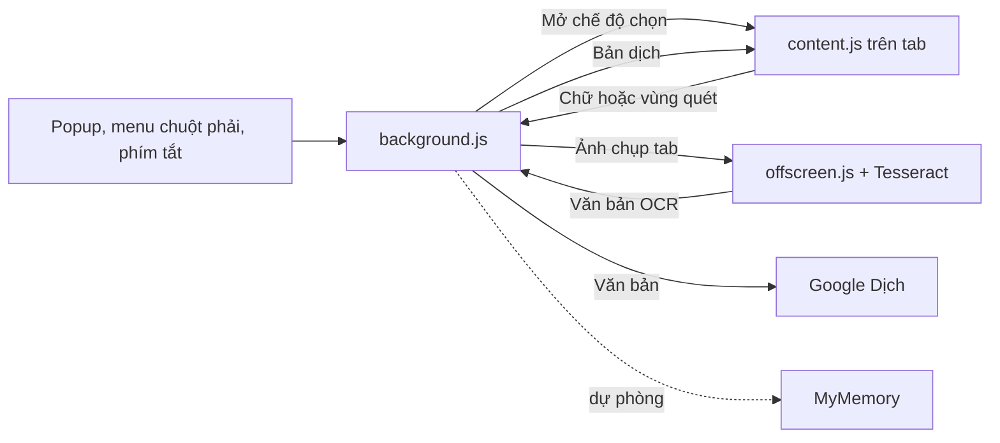

# Phát triển và kiểm thử

[Về README](../README.md) · [Quyền riêng tư](PRIVACY.md)

## Chuẩn bị môi trường

Cần Node.js bản LTS và npm. Tại thư mục gốc của repo:

```bash
npm ci
npm test
npm run build
```

Lệnh build tạo extension tự chứa trong `dist`. Thư mục này, `node_modules` và ZIP cài đặt được bỏ qua bởi Git. Khi cần thử trực tiếp, nạp `dist` bằng **Load unpacked** trong Chrome/Edge rồi bấm **Reload** sau mỗi lần build lại.

## Luồng xử lý



`background.js` chỉ chụp tab sau khi người dùng khoanh vùng. `offscreen.js` cắt ảnh và nhận chữ cục bộ, sau đó service worker mới gửi **văn bản** tới dịch vụ dịch. `content.js` hiển thị vùng chọn và thẻ kết quả.

## Các file chính

| File | Vai trò |
| --- | --- |
| [src/manifest.json](../src/manifest.json) | Quyền, service worker, popup và phím tắt đề xuất |
| [src/popup.html](../src/popup.html), [src/popup.css](../src/popup.css), [src/popup.js](../src/popup.js) | Giao diện và cài đặt trong popup |
| [src/content.js](../src/content.js) | Giao diện trên trang, chọn chữ, khoanh vùng, hiển thị bản dịch |
| [src/background.js](../src/background.js) | Điều phối lệnh, trạng thái, chụp tab, OCR và dịch |
| [src/offscreen.js](../src/offscreen.js) | Tesseract worker và tiền xử lý ảnh |
| [src/translation.js](../src/translation.js) | Chia đoạn, gọi Google/MyMemory, kiểm tra phản hồi và giới hạn |
| [src/shortcut.js](../src/shortcut.js) | Logic mở khoanh vùng từ phím tắt |
| [scripts/build.mjs](../scripts/build.mjs) | Đóng gói JS, WebAssembly và dữ liệu ngôn ngữ vào `dist` |
| [test/](../test/) | Unit test và kiểm thử Chromium |

OCR dùng Tesseract.js 7 (Apache 2.0) và các gói `@tesseract.js-data` (MIT) cho `eng`, `vie`, `jpn`, `kor`, `chi_sim`, `chi_tra`. Dữ liệu được copy vào `dist/vendor/lang`; OCR không cần tải mô hình từ mạng lúc sử dụng.

## Chạy kiểm thử

```bash
npm test
npm run build
npm run test:browser
```

`npm test` kiểm tra logic dịch và phím tắt. `npm run test:browser` khởi chạy Chromium với bản trong `dist`, thử các chế độ dịch/OCR và giao diện bật/tắt. Bài kiểm thử trình duyệt thay hai URL dịch bằng máy chủ cục bộ để không phụ thuộc hạn mức dịch công cộng. Nó kiểm tra phím tắt đã được Chromium đăng ký; sự kiện bấm phím ở cấp trình duyệt không được mô phỏng trong Chromium chạy ẩn.

Nếu máy chưa có Chromium cho Playwright, chạy `npx playwright install chromium` rồi thử lại. Các bài kiểm thử không chứng minh rằng endpoint dịch công cộng luôn sẵn sàng; xem [Xử lý lỗi](TROUBLESHOOTING.md) khi thử ngoài trình duyệt thật.

## Thay đổi và đóng gói phiên bản

Khi thêm ngôn ngữ OCR, cập nhật danh sách lựa chọn trong popup, danh sách hợp lệ ở `background.js` và `offscreen.js`, gói dữ liệu trong `package.json` và danh sách copy ở `scripts/build.mjs`. Kiểm tra việc đổi mô hình giữa các lần quét bằng `npm run test:browser`.

Khi phát hành phiên bản mới, đồng bộ `version` trong `package.json`, `package-lock.json` và `src/manifest.json`. Sau khi build và kiểm thử, có thể tạo ZIP chứa **nội dung** của `dist` bằng PowerShell:

```powershell
Compress-Archive -Path .\dist\* -DestinationPath .\Quet-va-Dich-extension.zip -Force
```

Thư mục gốc của ZIP phải có `manifest.json`. ZIP này là sản phẩm build cục bộ và không được commit vào repo. Người dùng cần giải nén trước khi chọn **Load unpacked**.
